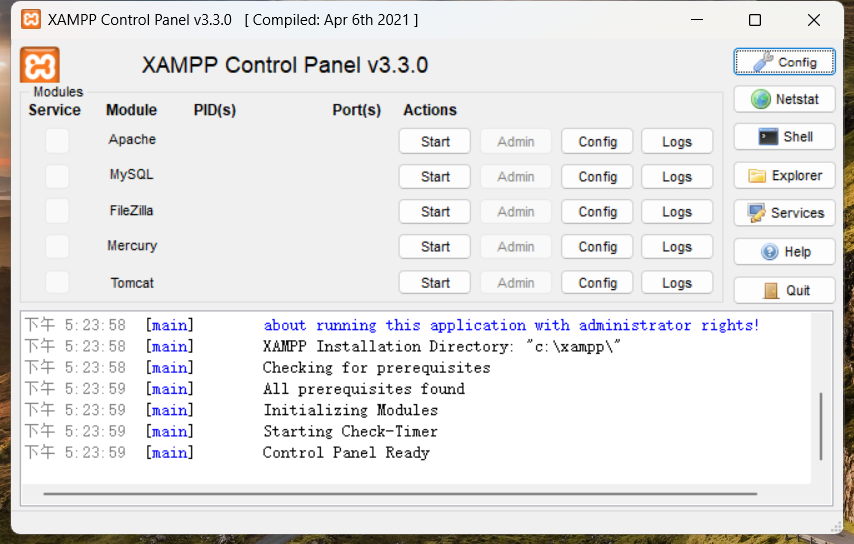
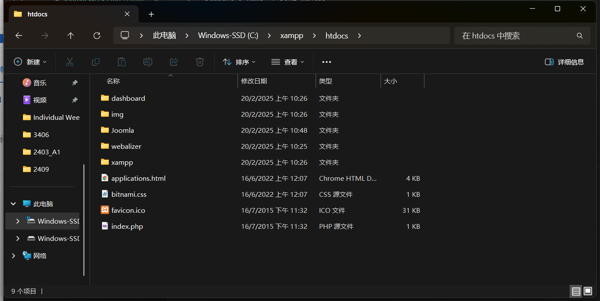
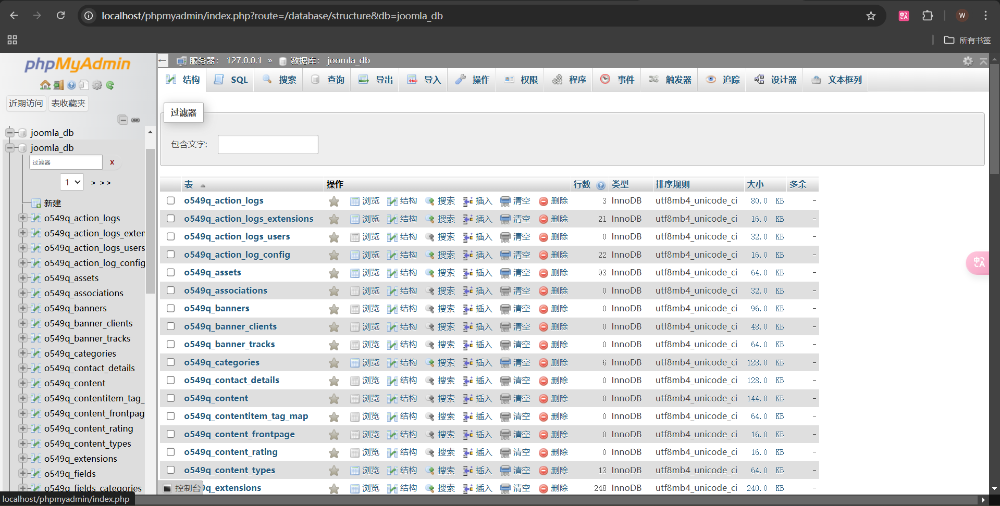
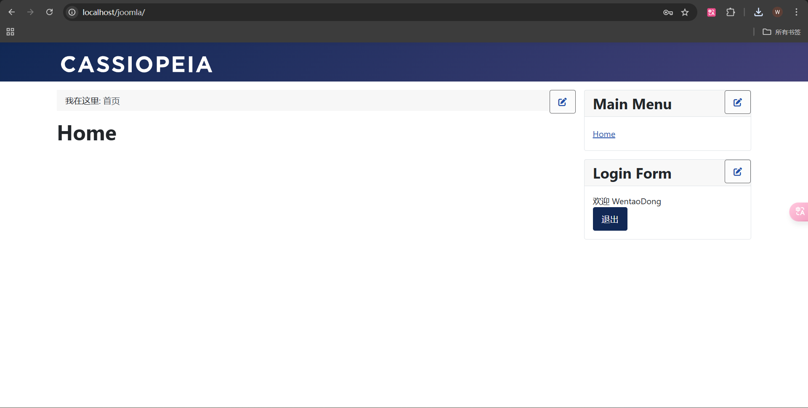
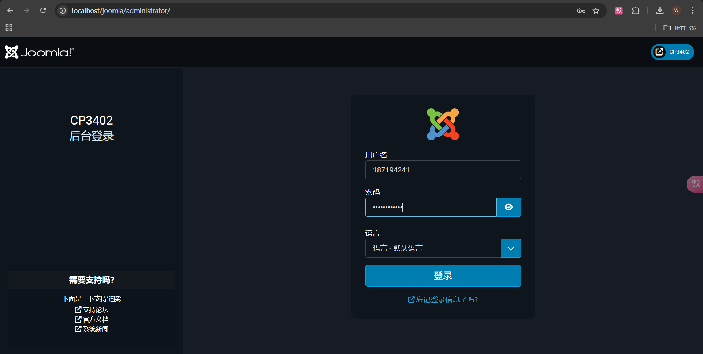
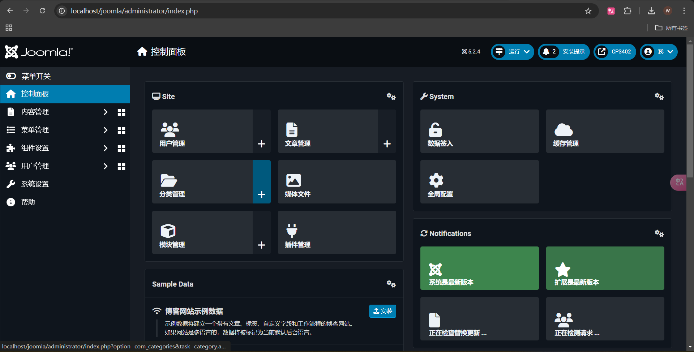
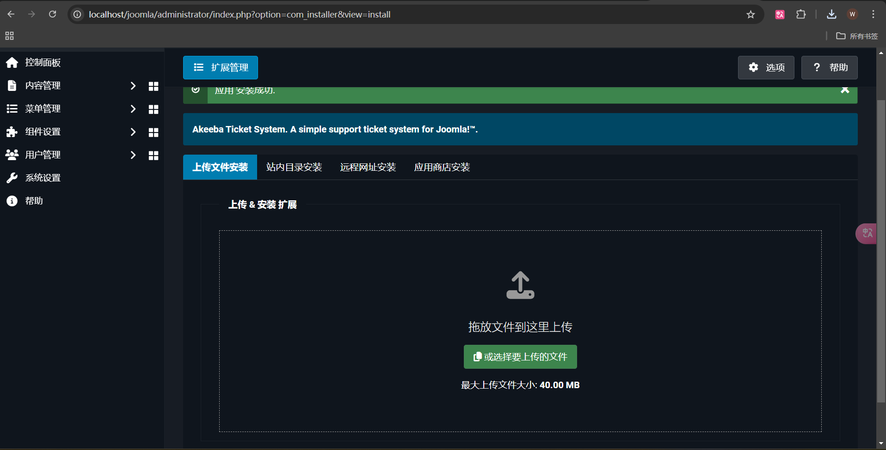
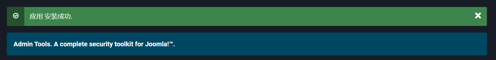
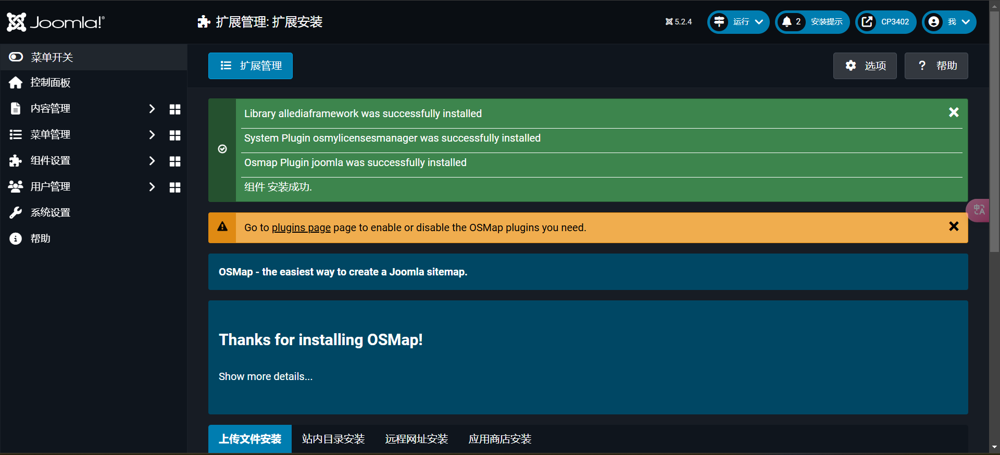

Student's name	: Dong Wentao
ID			: 14649801

20 / 2 / 2025 10:00am - 12:00am
22 / 2 / 2025 16:00pm - 18:00pm

## Week 4 - Development and deployment workflows

### Learning Activities & Resources:
In the fourth week of practicals, I explored how to host Joomla locally and create and manage databases to better understand the local development environment of the CMS.
To run Joomla locally, I installed XAMPP as a local server. XAMPP provides Apache (web server), MySQL/MariaDB (database), PHP (language environment required for Joomla! to run), and phpMyAdmin (database management tool). With XAMPP, I created a virtual server locally to make the Joomla website accessible.
In phpMyAdmin, I created a new database and connected it to it during the Joomla installation process. The Joomla installation wizard provides an easy way to configure database connections and ensure that the website can dynamically store and retrieve content.
After this, I installed the OSMap plugin to generate a site map and optimize SEO.
Use Akeeba Backup to backup the website to ensure data security.
Install Admin Tools to enhance the security of the Joomla! site.

### Steps screenshots:
Download XAMPP and start running Apache and MySQL.

Download and extract the Joomla files into the htdocs folder of XAMPP.

Successfully created database.

The Joomla localhost site was created successfully.
Joomla front-end screen.

Joomla backend login screen.

Joomla background screen.

Plugin Installation.
These plugins can automatically generate XML sitemaps for search engines and HTML sitemaps for visitors. They can also create complete site backups for easy recovery and migration.

### References:
1. https://des13.com/faq/cms/joomla/425-xampp-joomla.html
2. https://www.linkedin.com/learning/version-control-for-everyone-2
3. https://docs.joomla.org/J3.x%3AInstalling_Joomla/zh-tw

### Estimated Hours:
Spent 4 hours hosting, doing practicals and journaling.

### Content Insights:
Through this practice, I realized the importance of local hosting for developing Joomla websites. Although Joomla provides complete files and links, local environments such as XAMPP make the entire development and debugging process more efficient. With XAMPP, I can view and test my website functions in real time on the local server, avoiding the delays and network problems often encountered when using online hosts.

An obvious advantage of using a local environment is that I can modify and debug quickly and see the results immediately. In this way, if I can migrate a locally developed Joomla website to an online server, I can make all adjustments and optimizations in the local environment first, and then upload the complete website, which not only saves time, but also avoids frequent online debugging.

At the same time, the use of plug-ins allows me to implement website functions more efficiently. These plug-ins have made me more familiar with the extensibility of Joomla, and also made me realize that making full use of existing resources is very helpful in the development process.

### Career/Employability/Learning Insights:
This practice made me realize that mastering the process of local development and deployment and being familiar with common CMS tools and plug-ins will make me more competitive in my future career, especially when I am engaged in web development, project management or website maintenance. This not only improves my technical capabilities, but also provides more possibilities for the diversity and flexibility of my career development.